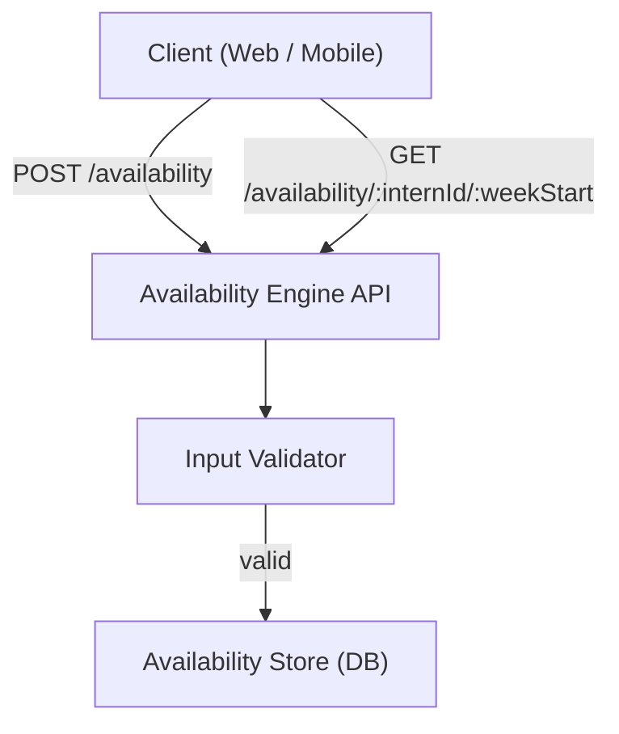
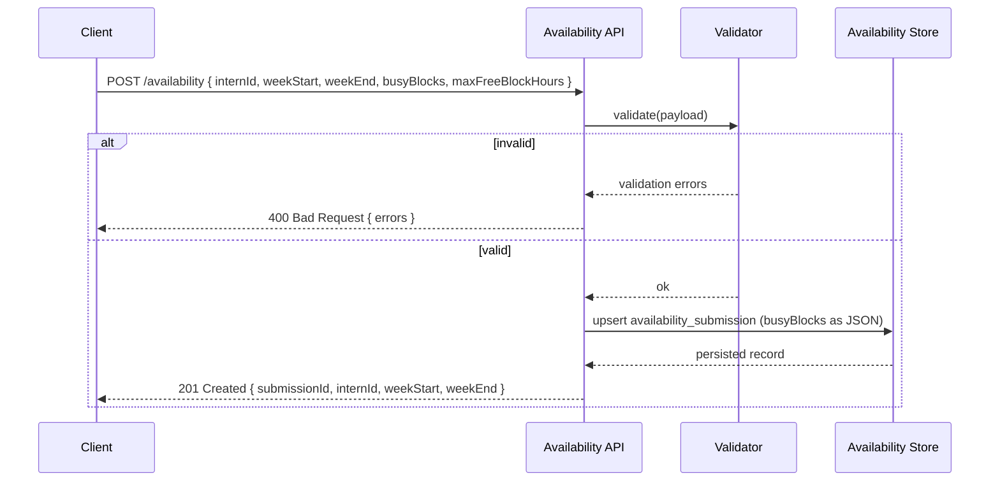
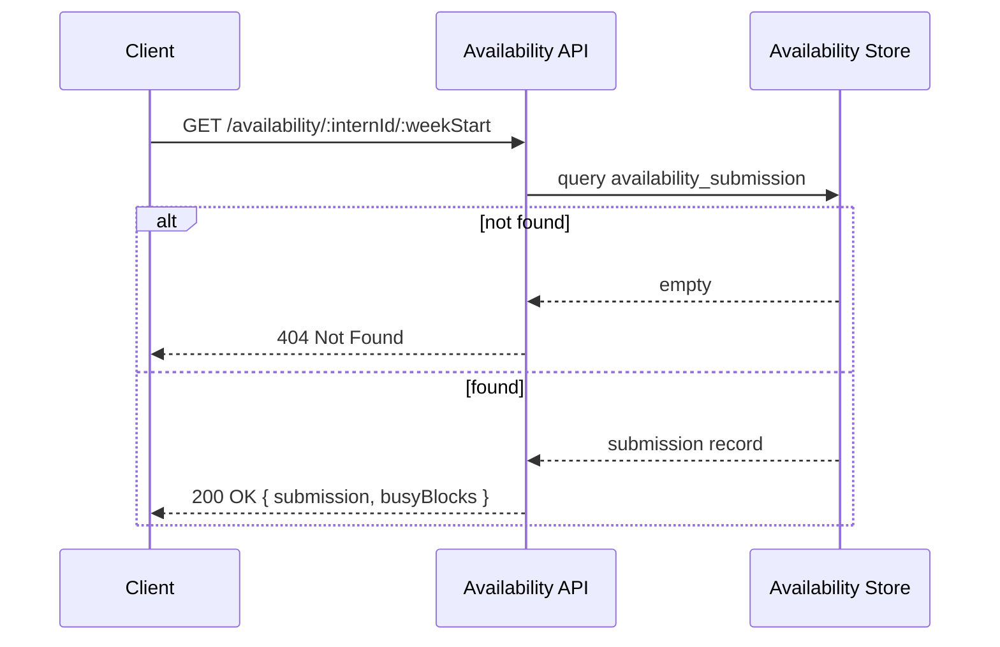
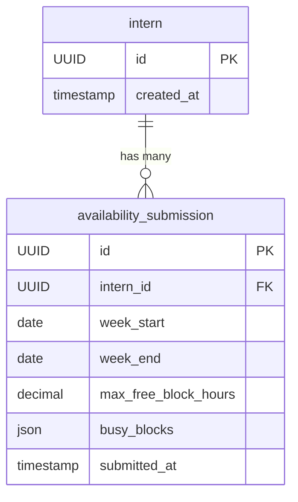

# Design Document: Availability Engine

## Overview

The Availability Engine collects and stores structured weekly availability submissions from interns. Interns submit their weekly schedule by declaring busy blocks and a maximum free-block hour cap. The engine validates, persists, and confirms these submissions. The stored data becomes the authoritative availability record for a given intern and week. Busy blocks are stored as an embedded JSON array on the submission record rather than a separate table.

## Architecture

## Sequence Diagrams

### Submit Availability

### Retrieve Availability

## Components and Interfaces

### Availability API

**Purpose**: HTTP entry point. Routes requests, delegates validation, orchestrates persistence, and returns responses.

**Endpoints**:

| Method | Path | Description |
|--------|------|-------------|
| POST | `/availability` | Submit or update a weekly availability record |
| GET | `/availability/:internId/:weekStart` | Retrieve a submission and its busy blocks |

---

### Input Validator

**Purpose**: Enforces business rules on incoming payloads before any data is persisted.

**Responsibilities**:
- Confirm all required fields are present and correctly typed
- Verify `weekEnd` is after `weekStart` and the range spans exactly 7 days
- Verify each busy block's `start` is before its `end`
- Verify busy blocks do not overlap within the same day
- Verify `maxFreeBlockHours` is a positive number
- Return a structured list of validation errors when rules are violated

---

### Availability Store

**Purpose**: Persistence layer. Owns all reads and writes for `availability_submission` records.

**Responsibilities**:
- Upsert an `availability_submission` for a given `(internId, weekStart)` pair, storing busy blocks as an embedded JSON column
- Fetch a submission by `(internId, weekStart)`

## Data Models

### intern

Minimal entity representing an intern. Referenced by availability submissions.

| Field | Type | Constraints |
|-------|------|-------------|
| id | UUID | Primary key |
| created_at | Timestamp | Not null |

---

### availability_submission

One record per intern per week. Upserted on each submission so the latest data always wins. Busy blocks are stored as an embedded JSON array.

| Field | Type | Constraints |
|-------|------|-------------|
| id | UUID | Primary key |
| intern_id | UUID | FK → intern.id, not null |
| week_start | Date | Not null |
| week_end | Date | Not null |
| max_free_block_hours | Decimal | Not null, > 0 |
| busy_blocks | JSON | Not null, array of `{ day, start_time, end_time }` objects |
| submitted_at | Timestamp | Not null, set on upsert |

Unique constraint: `(intern_id, week_start)`

---

### Entity Relationship

## API Design

### POST /availability

Submits or updates a weekly availability record for an intern.

**Request Body**

| Field | Type | Required | Description |
|-------|------|----------|-------------|
| internId | UUID | Yes | Intern identifier |
| weekStart | Date (ISO 8601) | Yes | Monday of the target week |
| weekEnd | Date (ISO 8601) | Yes | Sunday of the target week |
| busyBlocks | Array | Yes | List of unavailable time blocks (may be empty) |
| busyBlocks[].day | Enum (MON–SUN) | Yes | Day of the week |
| busyBlocks[].start | Time (HH:MM) | Yes | Block start time |
| busyBlocks[].end | Time (HH:MM) | Yes | Block end time |
| maxFreeBlockHours | Number | Yes | Max hours the intern is willing to work |

**Success Response — 201 Created**

| Field | Type | Description |
|-------|------|-------------|
| submissionId | UUID | ID of the created/updated submission |
| internId | UUID | Echo of the intern identifier |
| weekStart | Date | Echo of the week start |
| weekEnd | Date | Echo of the week end |

**Error Response — 400 Bad Request**

| Field | Type | Description |
|-------|------|-------------|
| errors | Array of String | List of human-readable validation messages |

---

### GET /availability/:internId/:weekStart

Retrieves the availability submission and all busy blocks for a given intern and week.

**Path Parameters**

| Parameter | Type | Description |
|-----------|------|-------------|
| internId | UUID | Intern identifier |
| weekStart | Date (ISO 8601) | Monday of the target week |

**Success Response — 200 OK**

| Field | Type | Description |
|-------|------|-------------|
| submissionId | UUID | Submission identifier |
| internId | UUID | Intern identifier |
| weekStart | Date | Week start date |
| weekEnd | Date | Week end date |
| maxFreeBlockHours | Number | Declared max free hours |
| submittedAt | Timestamp | When the record was last upserted |
| busyBlocks | Array | Embedded list of busy block objects |
| busyBlocks[].day | Enum | Day of the week |
| busyBlocks[].start | Time | Block start time |
| busyBlocks[].end | Time | Block end time |

**Error Response — 404 Not Found**: Returned when no submission exists for the given `(internId, weekStart)` pair.

## Error Handling

### Validation Failure

**Condition**: Payload fails one or more business rules
**Response**: 400 Bad Request with an `errors` array listing each violated rule
**Recovery**: Client corrects the payload and resubmits

### Submission Not Found (GET)

**Condition**: No `availability_submission` exists for the given `(internId, weekStart)` pair
**Response**: 404 Not Found

### Persistence Failure

**Condition**: Database write fails
**Response**: 500 Internal Server Error with a generic error message
**Recovery**: Client may retry after a brief delay

## Correctness Properties

*A property is a characteristic or behavior that should hold true across all valid executions of a system — essentially, a formal statement about what the system should do. Properties serve as the bridge between human-readable specifications and machine-verifiable correctness guarantees.*

### Property 1: Submit then retrieve round-trip

*For any* valid submission payload, submitting via POST /availability and then retrieving via GET /availability/:internId/:weekStart should return a record whose `internId`, `weekStart`, `weekEnd`, `maxFreeBlockHours`, and `busyBlocks` are equivalent to the submitted values.

**Validates: Requirements 1.1, 3.1**

### Property 2: Upsert overwrites previous submission

*For any* two sequential valid submissions for the same `(internId, weekStart)` pair, retrieving the record after the second submission should return data matching the second submission, not the first.

**Validates: Requirement 1.2**

### Property 3: Missing required fields always produce 400

*For any* POST /availability payload with one or more required fields (`internId`, `weekStart`, `weekEnd`, `busyBlocks`, `maxFreeBlockHours`) removed, the Validator should return a 400 response containing an `errors` array that references each missing field.

**Validates: Requirement 2.1**

### Property 4: Invalid week range always produces 400

*For any* `(weekStart, weekEnd)` pair where the difference is not exactly 7 days, the Validator should return a 400 response.

**Validates: Requirement 2.2**

### Property 5: Inverted busy block times always produce 400

*For any* BusyBlock where `start >= end`, the Validator should return a 400 response.

**Validates: Requirement 2.3**

### Property 6: Overlapping busy blocks on the same day always produce 400

*For any* two BusyBlocks on the same day whose time ranges overlap, the Validator should return a 400 response.

**Validates: Requirement 2.4**

### Property 7: Non-positive maxFreeBlockHours always produces 400

*For any* `maxFreeBlockHours` value that is zero or negative, the Validator should return a 400 response.

**Validates: Requirement 2.5**
